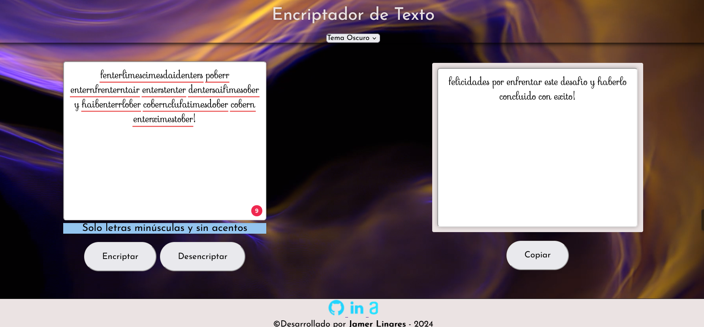

# <h1 align="center"> Encriptador-de-texto ORACLE alura</h1>
-git status: ended

[This site was built using [GitHub Pages and Visual Studio Code]

!

Ante la necesidad de transmitir información escrita de manera privada nace el mensaje encriptado.Buscando suplir esta necesidad nace esta pagina web, la cual toma un mensaje **INICIAL** del emisor el cual cambiara sus vocales con el fin de proteger la información, hasta que llegue a las manos del receptor quien usando la pagina web Desencriptara el mensaje **FINAL*.  

Con las bases adquiridas en el programa **ONE** de la empresa **Oracle** usando lenguajes de demarcado __HTML__ dandole un diseño estimado con __CSS__ siguiendo el diseño de *FIGMA* y agregando las fucnionalidades con **JavaScript**. se presentan las condiciones bajo la cuales debe desarrollarse la solución:

## Condiciones

Vamos a trabajar en una aplicación que encripta textos, así podrás intercambiar mensajes secretos con otras personas que sepan el secreto de la encriptación utilizada.

Las "llaves" de encriptación que utilizaremos son las siguientes:

La letra "e" es convertida para "enter"
La letra "i" es convertida para "imes"
La letra "a" es convertida para "ai"
La letra "o" es convertida para "ober"
La letra "u" es convertida para "ufat"

### Requisitos:

    Debe funcionar solo con letras minúsculas
    No deben ser utilizados letras con acentos ni caracteres especiales
    Debe ser posible convertir una palabra para la versión encriptada también devolver una palabra encriptada para su versión original.

Por ejemplo:
"gato" => "gaitober"
gaitober" => "gato"

    La página debe tener campos para
    inserción del texto que será encriptado o desencriptado, y el usuario debe poder escoger entre las dos opciones.
    El resultado debe ser mostrado en la pantalla.

#### Extras:

    Un botón que copie el texto encriptado/desencriptado para la sección de transferencia, o sea que tenga la misma funcionalidad del ctrl+C o de la opción "copiar" del menú de las aplicaciones.

#### Resultado

!

